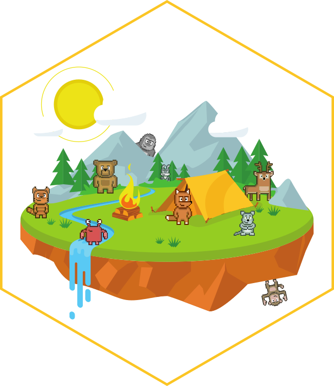

<!-- README.md is generated from README.Rmd. Please edit that file -->

```{r setup, include = FALSE}
knitr::opts_chunk$set(
  collapse = TRUE,
  comment = "#>",
  fig.path = "man/figures/README-",
  out.width = "100%"
)
```
[](https://travis-ci.org/r-spatialecology/landscapeverse)
[](https://ci.appveyor.com/project/r-spatialecology/landscapeverse)
<!-- [](https://www.tidyverse.org/lifecycle/#maturing) -->

# landscapeverse 

The goal of **landscapeverse** is to make it easy to install and load core packages for landscape analysis in a single command.

## Installation

You can install the released version of landscapeverse from [CRAN](https://CRAN.R-project.org) with:

``` r
install.packages("landscapeverse")
```

Or the development version from GitHub:

```r
# install.packages("devtools")
devtools::install_github("hadley/tidyverse")
```

## Usage

`library(landscapeverse)` will load the core landscapeverse packages: 

* [landscapemetrics](https://r-spatialecology.github.io/landscapemetrics/), for calculating landscape metrics for categorical landscape patterns in a tidy workflow.
* [NLMR](https://ropensci.github.io/NLMR/), for simulating neutral landscape models (NLM).
* [landscapetools](https://ropensci.github.io/landscapetools/), provides utility functions to work with landscape data.

## Packages

As well as the core landscapeverse, installing this package also installs a selection of other packages that you’re likely to use frequently, but probably not in every analysis. 
This includes packages:

* [belg](https://r-spatialecology.github.io/belg/), for calculating the Boltzmann entropy of a landscape gradient.
